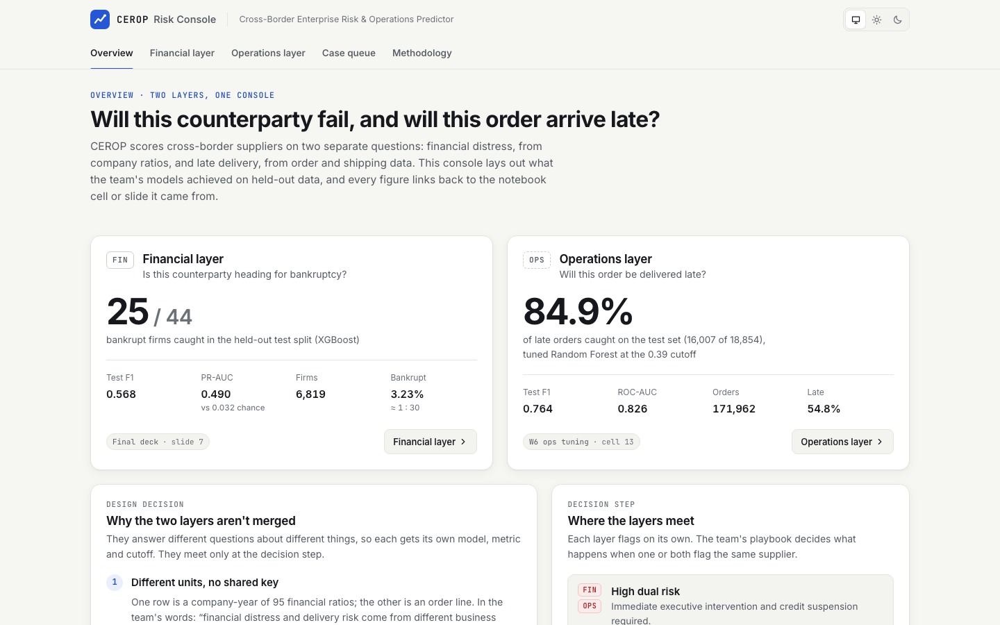

# CEROP Risk Console

A console for CEROP (Cross-Border Enterprise Risk & Operations Predictor), a two-layer machine-learning model that asks two separate questions about a supplier: *is this company heading for bankruptcy?* and *will this order arrive late?*

Every number in the console comes from the team's executed notebooks, a result file one of them saved, or the final slides. Each figure carries a small source chip that links to its row in a lineage table (file, cell or slide, and what was read there). Anything the record doesn't contain is left out and listed as missing.

**Live:** https://divyagopalnadar.github.io/cerop-console/



## Features

- **Overview.** Headline results for both layers, the three reasons the layers stay separate, and the team's playbook for when one or both flag the same supplier.
- **Financial layer.** XGBoost results on the held-out split, a confusion matrix rebuilt from the reported figures (with the derivation shown), why the team kept the baseline model, and the data prep that takes 95 ratios to 85 features.
- **Operations layer.** A threshold explorer over the team's 81-step validation sweep: a slider plus a clickable chart show precision, recall and F1, and what the cutoff means per 1,000 orders (flagged, caught, missed). Below it: the sealed-test comparison of baseline, tuned, and tuned with a calibrated cutoff; a confusion-matrix viewer; the target-leakage fix; the tuning setup; and feature importances.
- **Case queue.** A triage list (needs review / on watch / cleared) with search, layer and status filters, sorting, a dual-risk flag, and an expandable "why" for each case. **The cases are illustrative, not real model output**, and the page says so.
- **Methodology.** The protocol (split, fit on train, tune, calibrate on validation, open the test set once), a lineage table for all 27 sources, the derived values and how they were computed, and what is not in the record.
- Light and dark themes with a system default and no flash on load; hash routing so deep links work on GitHub Pages (e.g. `#/operations?t=0.45`, `#/lineage?src=ops-w6-test`); responsive down to 390px.
- Accessibility: ARIA tabs with arrow/Home/End keys and a roving tabindex, labelled controls, native radio groups for segmented controls, charts backed by tables or text, visible focus, reduced-motion support, and status shown as icon plus label rather than colour alone.

## Modelling summary

| | Financial layer | Operations layer |
|---|---|---|
| Question | Will this counterparty go bankrupt? | Will this order be delivered late? |
| Data | Taiwanese Bankruptcy Prediction: 6,819 firms, 95 ratios, 3.23% bankrupt (≈ 1 : 30) | DataCo Smart Supply Chain + NY Fed GSCPI: 171,962 orders after removing a Nov–Dec 2017 artefact, 54.82% late |
| Split | Stratified 80/20: 5,455 train / 1,364 test, 85 features after cleaning | Stratified 80/20: 137,569 train / 34,393 test; training further split 110,055 dev / 27,514 validation; 27 features |
| Model | XGBoost, baseline configuration | Random Forest, tuned (RandomizedSearchCV, 25 × 3-fold, best CV F1 0.7051) |
| Cutoff | Not recorded | 0.39, the validation-F1 maximum |
| Test result | Recall 0.568 (25 of 44 bankrupt firms caught), F1 0.568, PR-AUC 0.490 | Recall 0.849, precision 0.694, F1 0.764, ROC-AUC 0.826, PR-AUC 0.873 |

What the operations numbers show:

- **Tuning alone didn't help F1.** On the test set the corrected baseline scored F1 0.7251 at 0.50 and the tuned model 0.7214. Tuning did lift ROC-AUC from 0.8138 to 0.8258.
- **Calibration did.** Moving the cutoff to 0.39, chosen on validation data, raised test recall from 0.629 to 0.849 and F1 to 0.764, at the cost of precision (0.846 → 0.694).
- **Fixing the leak cost points, as it should.** The Week 5 feature set had 35 columns, including eight Order Status fields that encode the delivery outcome. Removing them dropped Random Forest's test F1 from 0.7388 to 0.7251 and its ROC-AUC from 0.855 to 0.814.

For the financial layer, the final deck records the challenge ("Data Scarcity & Measurement Noise") and the decision ("Baseline Model Robustness"). With 44 bankrupt firms in the test split, each firm is worth 2.3 points of recall.

## Data provenance

`scripts/extract_data.py` parses executed cell outputs, one saved result CSV and slide XML into `src/data/*.json`. Each record gets a `source` id that resolves in `src/data/sources.json`. The notebooks and decks are not in this repository.

| Source file | Used for |
|---|---|
| `AIT506_Week6_Operations_Model_Tuning.ipynb` (cells 0, 4, 6, 8, 10, 13) | Corrected data shapes, validation split, search, chosen threshold, final test results |
| `week6_operations_results/week6_operations_threshold_results.csv` (saved by cell 19 of the notebook above) | The full 81-row validation sweep; checked against the printed top five |
| `AIT506_Week5_Operational_Model_Selection.ipynb` (cells 3, 5, 11, 16, 18, 20, 24) | Class balance, Week 5 shortlist, CV, RBF check, feature importances |
| `Week4_CEROP_Pipeline_Integration_FIXED_v3.ipynb` (cells 3, 8, 10, 14, 21) | Financial split and feature count, DataCo row counts, GSCPI note |
| `WEEK_4_—_Financial_Layer_Cleaning_(Taiwan_Bankruptcy_Dataset).ipynb` (cells 0, 2, 5) | Dataset shape, outlier tiers |
| `CEROP_Unified_Risk_Intelligence.pptx` (slides 1, 3, 5, 6, 7) | Financial test results, strategy, protocol, playbook, team |
| `CEROP_PCA_Class_Activity.pptx` (slide 1), `CEROP_Class_Activity_5_Slides_Final.pptx` (slide 2) | 3.23% positive class; why the datasets can't be merged |

**Derived values** (computed, not read): the validation positive count (15,083, from the 1/N steps in recall), the per-1,000 outcome counts, and the financial confusion matrix (TN 1,301, FP 19, FN 19, TP 25), which is the only integer solution consistent with 25 of 44 caught, F1 0.568 and 1,364 test firms. The tests re-derive all three.

**Not in the record:** the financial model-selection notebook (XGBoost against Logistic Regression and others), financial tuned-versus-untuned scores, metrics at equal recall, the financial cutoff, per-case predictions, and importances for the corrected 27-feature operations model. None of these is shown.

## Tech stack

- Vite 8, React 19, TypeScript 6 in strict mode (with `noUncheckedIndexedAccess` and `exactOptionalPropertyTypes`)
- CSS Modules on a small set of design tokens; no UI kit and no chart library. The charts are hand-built SVG and HTML, and the palette was checked with a CVD and contrast validator for both themes.
- Vitest and Testing Library: 47 tests covering data integrity (matrices sum to the test sets, precision/recall/F1 recomputed from counts, sweep ordering and consistency, provenance coverage) and interactions (tabs and keyboard, threshold slider and deep links, queue filtering, theme)
- oxlint with React, jsx-a11y and Vitest rules
- A GitHub Actions workflow that runs lint, typecheck, tests and build on Node 22, then deploys to GitHub Pages from `main`

## Getting started

```bash
npm ci
npm run dev          # http://localhost:5173/cerop-console/
npm run check        # lint + typecheck + tests + build
npm run preview      # serve the production build
npm run extract -- ~/Downloads   # regenerate src/data from the team's files
```

## Credits

Team project · AIT 506 Machine Learning, Westcliff University · Console designed and built by Divya Gopal.

CEROP was built by Group 4: Ankit Kumar, Aswin Shriram Thiagarajan, Arthunya Kanoklertwongse and Divya Gopal. The modelling is the team's work. This console (its design, data extraction and code) is Divya's.
